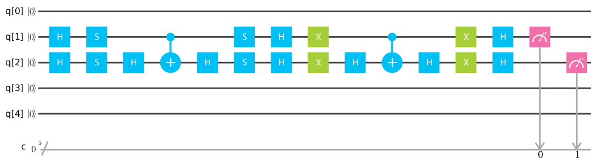

# quantum perceptron
[](https://docs.microsoft.com/en-us/quantum/quantum-qr-intro?view=qsharp-preview)
[](https://opensource.org/licenses/MIT)



Code to implement a quantum 2-dimensional perceptron using qubits

The idea was from [this article](http://papers.nips.cc/paper/2363-training-a-quantum-neural-network.pdf
) which authors suggest to use Grover algorithm to search weights to use in the machine learning model

# q-sharp

Language used to run this project is **[q#](https://docs.microsoft.com/en-us/quantum/quantum-qr-intro?view=qsharp-preview)**

# IBM quantum experience
```c#
Boolean RunOnIBM = false;
```
setting **true** this variable project will be run on [IBM quantum experience](https://quantumexperience.ng.bluemix.net/qx/editor)

# LICENSE
See [LICENSE](LICENSE)
